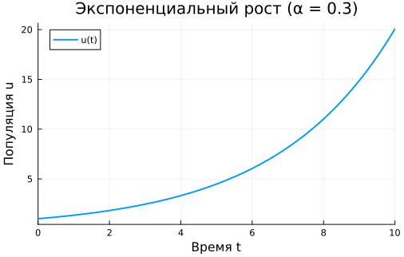
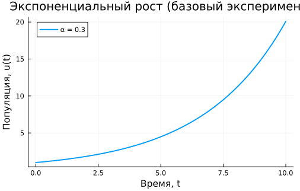
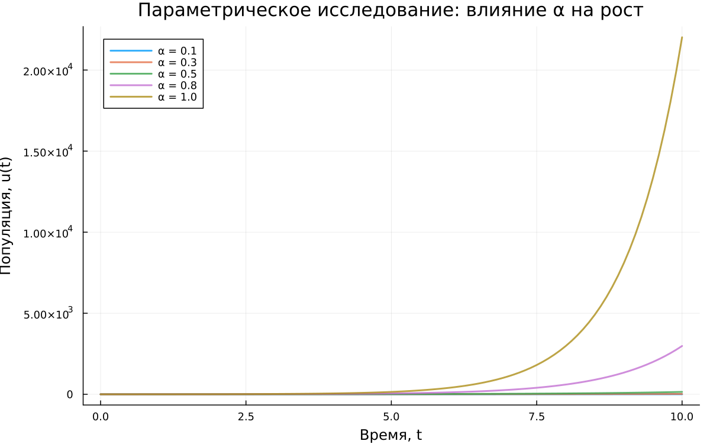
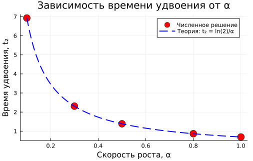
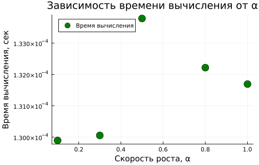

---
## Author
author:
  name: Машков Илья Евгеньевич
  email: 1132231984@rudn.ru
  affiliation:
    - name: Российский университет дружбы народов
      country: Российская Федерация
      postal-code: 117198
      city: Москва
      address: ул. Миклухо-Маклая, д. 6
## Title
title: Лабораторная работа №1
subtitle: Имитационное моделирование
license: CC BY
date: 2026-09-02
date-format: "YYYY-MM-DD"
---

## Цель работы

Подготовка стенда для дальнейшей работы. Изучение модели экспоненциального роста.

## График обычного экспоненциального роста

{width=50%}

## Графики параметрического исследования

{width=50%}

## Графики параметрического исследования

{width=50%}

## Графики параметрического исследования

{width=50%}

## Графики параметрического исследования

{width=50%}

## Выводы

Во время выполнения данной лабораторной работы я подготовил стенд и освоил навыки работы с моделями с помощью julia.

