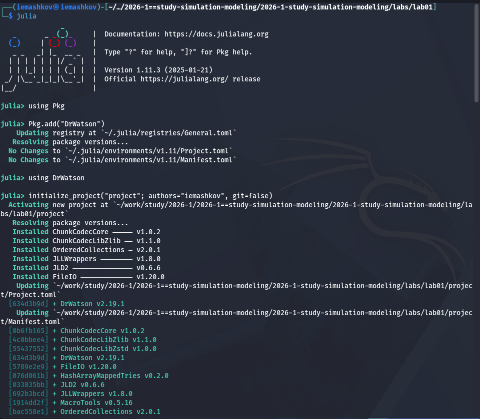
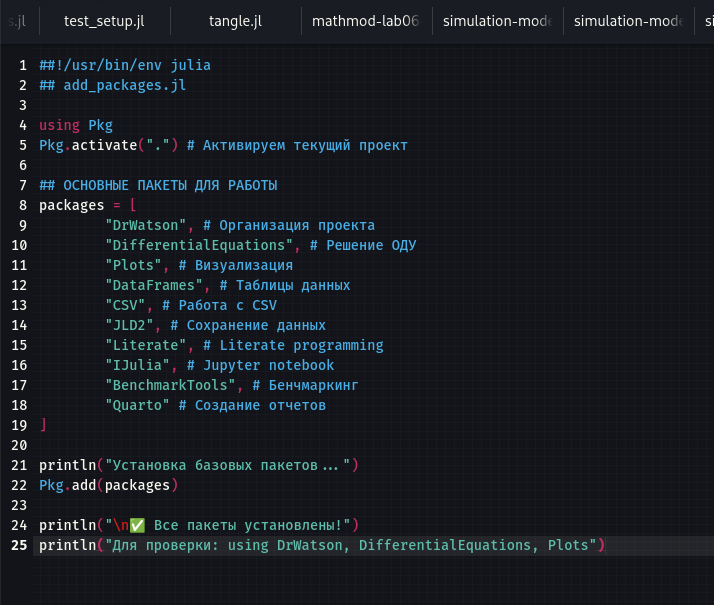
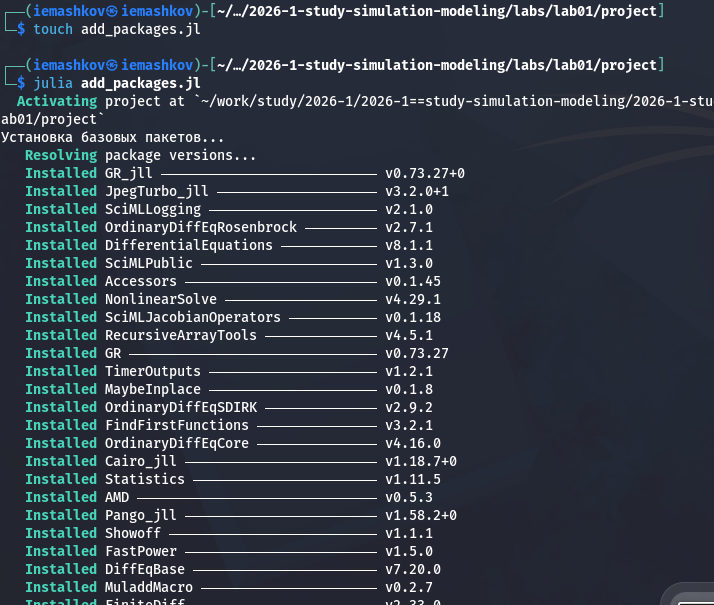
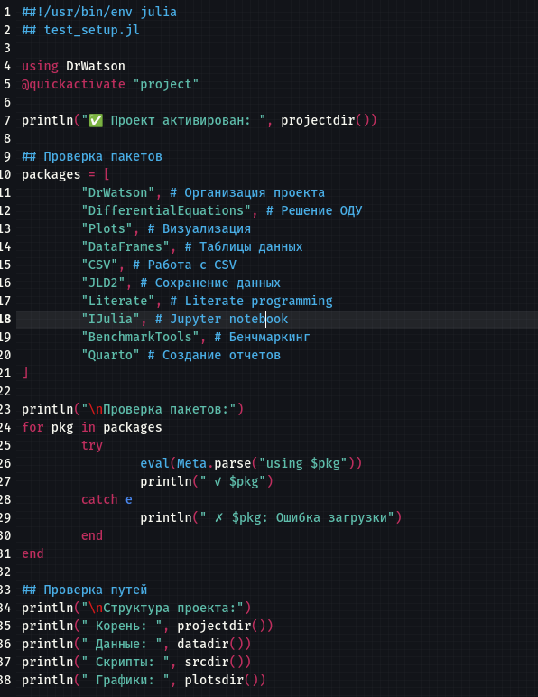
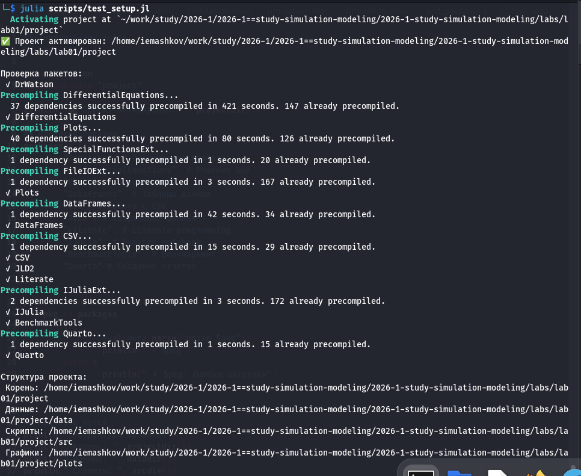
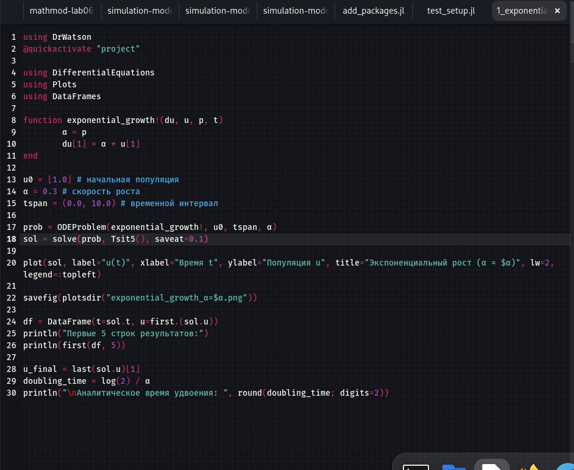
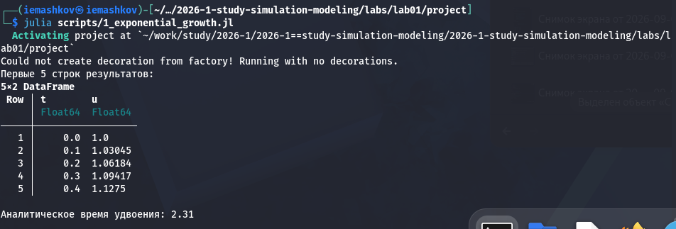
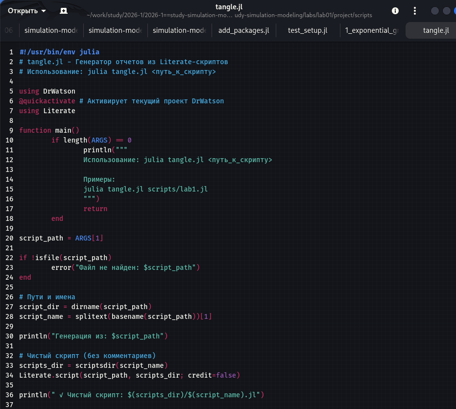
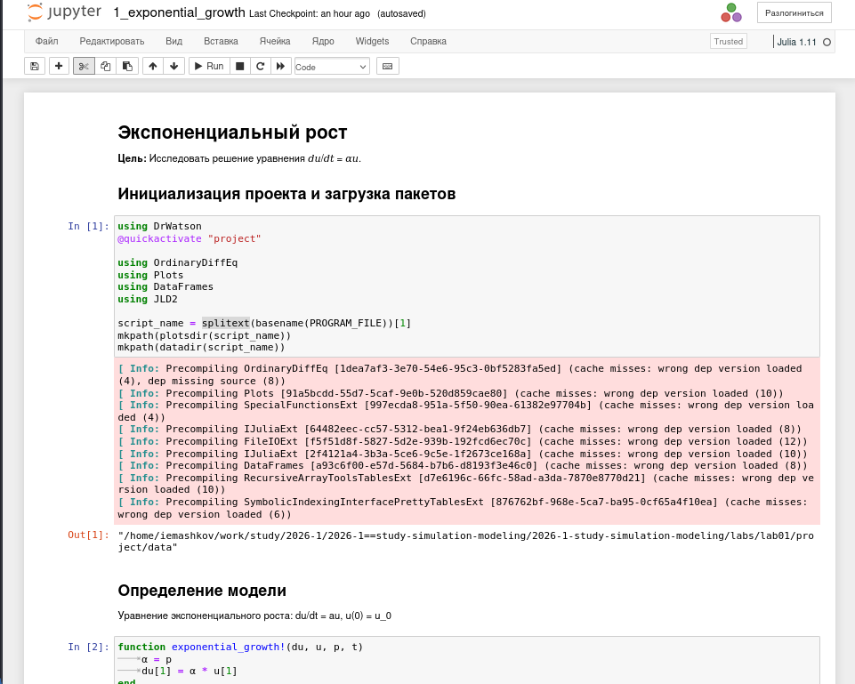
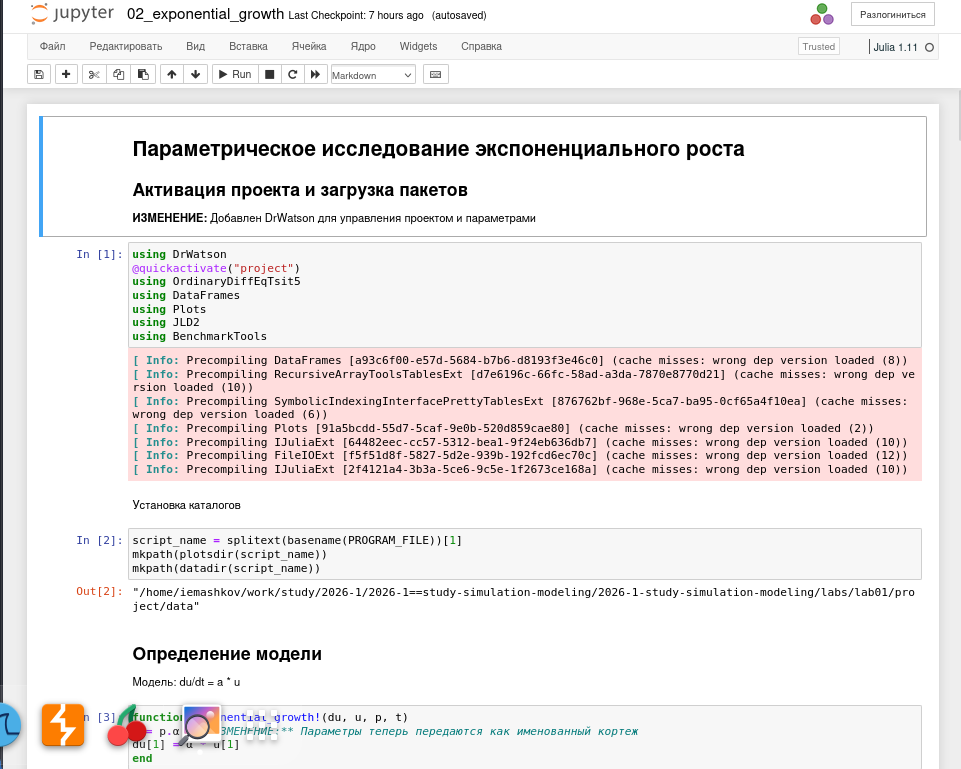

---
## Author
author:
  name: Машков И.Е.
  email: 1132231984@rudn.ru
  affiliation:
    - name: Российский университет дружбы народов
      country: Российская Федерация
      postal-code: 117198
      city: Москва
      address: ул. Миклухо-Маклая, д. 6

## Title
title: "Отчёт по лабораторной работе №1"
subtitle: "Имитационное моделирование"
license: "CC BY"
---

# Цель работы

Подготовка стенда для дальнейшей работы. Изучение модели экспоненциального роста.

# Задание 

— Создать рабочий каталог для кода.
— Установить необходимые пакеты.
— Выполнить предложенный код.
— Преобразовать код в литературный стиль.
— Сгенерировать из литературного кода:
— чистый код;
— jupyter notebook;
— документацию в формате Quarto.
— Выполнить код из jupyter notebook.
— Интегрировать документацию в формате Quarto в отчёт.
— Добавить в код в литературном стиле вычисление для набора параметров.
— Сгенерировать из литературного кода с параметрами:
— чистый код;
— jupyter notebook;
— документацию в формате Quarto.
— Выполнить код из jupyter notebook с параметрами.
— Интегрировать документацию с параметрами в формате Quarto в отчёт.

# Выполнение лабораторной работы

## Подготовка стенда

Т.к. эту лабораторную я делаю с большим опозданием, система Kali у меня уже стояла, были настроены git, quarto, julia и т.д. Поэтому скриншоты я не делал.

## Работа с моделью экспоненциального роста

Перехожу в директорию первой лабораторной работы и разворачиваю в ней проект в отдельной папке "project" ([рис. @fig-001]).

{#fig-001 width=70%}

Затем создаю скрипт для установки нужных пакетов для работы с моделью ([рис. @fig-002]).

{#fig-002 width=70%}

Запускаю скрипт ([рис. @fig-003])

{#fig-003 width=70%}

Создаю скрипт для проверки структуры проекта и всех установленных пакетов ([рис. @fig-004]).

{#fig-004 width=70%}

Запускаю скрипт и убеждаюсь в правильности структуры ([рис. @fig-005]).

{#fig-005 width=70%}

## Работа с моделью

Создаю скрипт для модели экспоненциального роста и ввожу туда код модели ([рис. @fig-006]).

{#fig-006 width=70%}

Запускаю скрипт и вижу результирующую таблицу и график ([рис. @fig-007]).

{#fig-007 width=70%}

Теперь создаю скрипт для создания производных форматов ipunb, markdown и т.д. ([рис. @fig-008]).

{#fig-008 width=70%}

После выполнения скрипта получаю готовый jupiter notebook с кодом и литературным описанием ([рис. @fig-009]).

{#fig-009 width=70%}





То же делаю и со второй моделью ([рис. @fig-010]).

{#fig-010 width=70%}

# Выводы

Во время выполнения данной лабораторной работы я подготовил стенд и освоил навыки работы с моделями с помощью julia.

