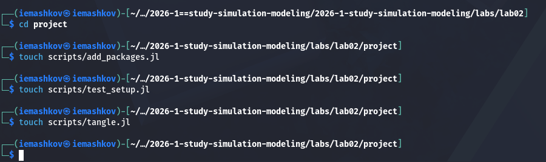
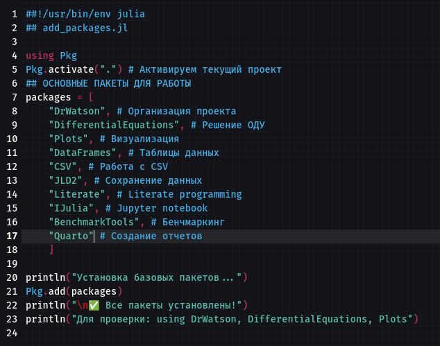
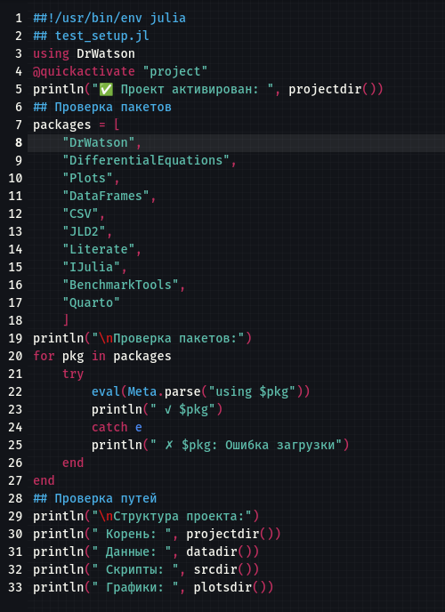
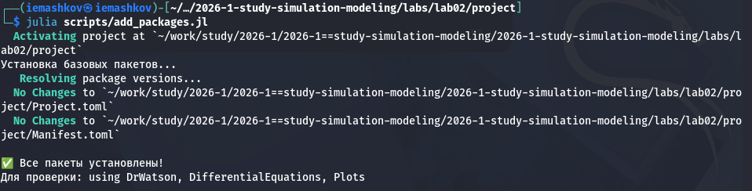
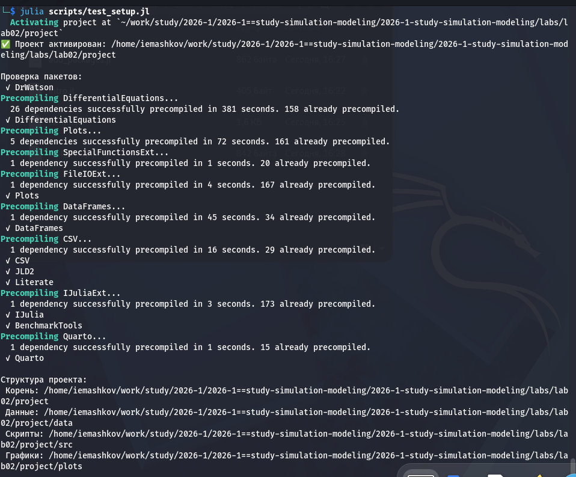
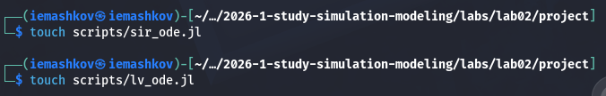
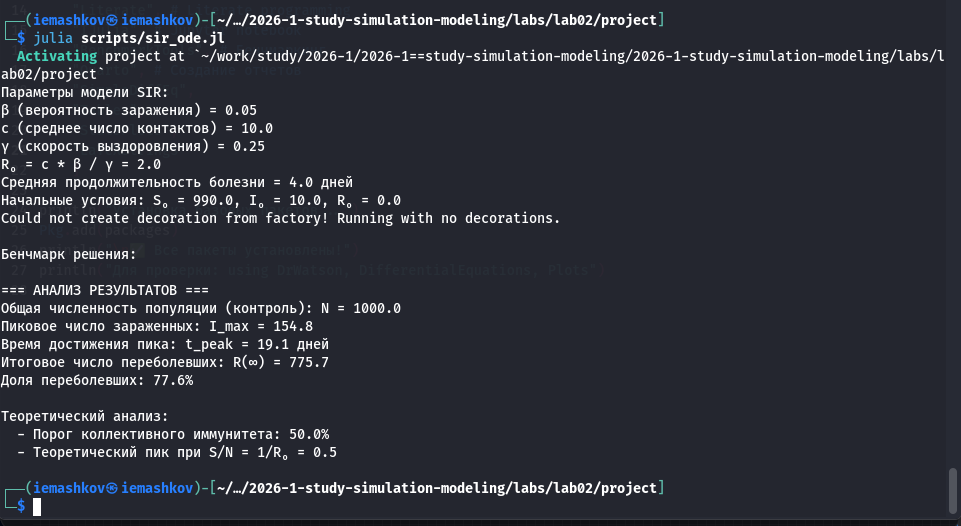
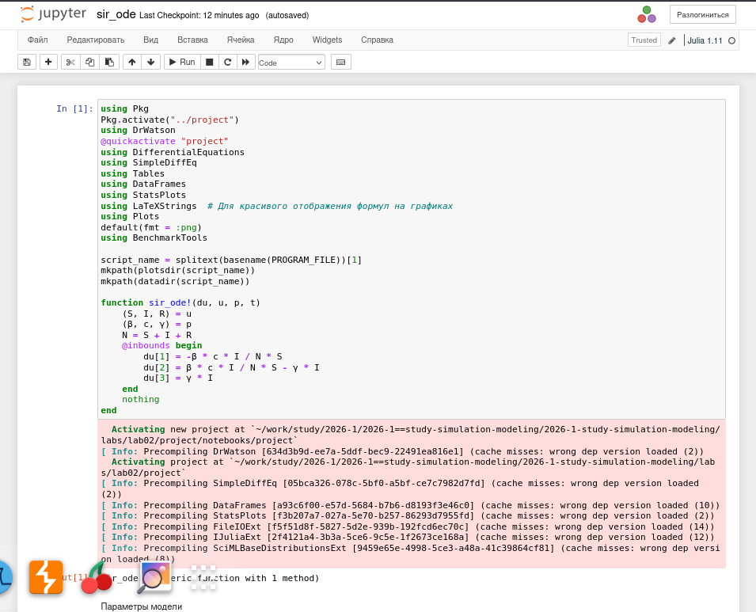
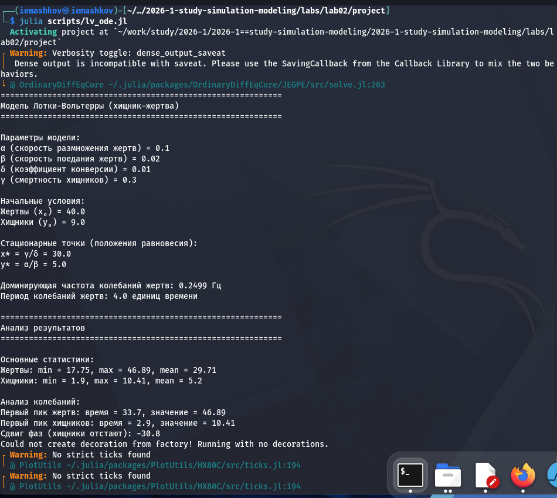
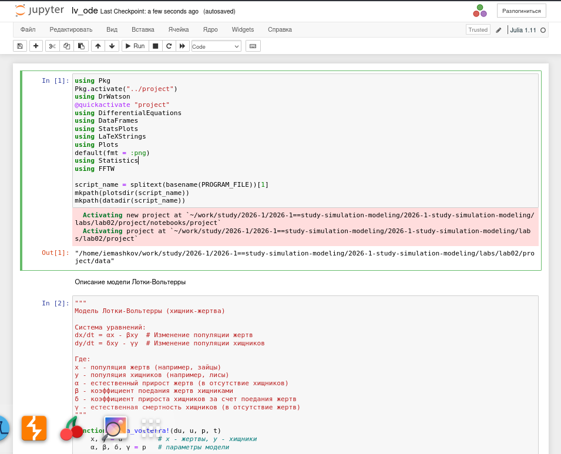

---
## Author
author:
  name: Машков И.Е.
  email: 1132231984@rudn.ru
  affiliation:
    - name: Российский университет дружбы народов
      country: Российская Федерация
      postal-code: 117198
      city: Москва
      address: ул. Миклухо-Маклая, д. 6

## Title
title: "Отчёт по лабораторной работе №2"
subtitle: "Имитационное моделирование"
license: "CC BY"
---

# Цель работы

Изучение основных моделей SIR и Лотки-Вольтерры

# Задание 

— Создать рабочий каталог для кода.
— Установить необходимые пакеты.
— Выполнить предложенный код.
— Преобразовать код в литературный стиль.
— Сгенерировать из литературного кода:
— чистый код;
— jupyter notebook;
— документацию в формате Quarto.
— Выполнить код из jupyter notebook.
— Интегрировать документацию в формате Quarto в отчёт.
— Добавить в код в литературном стиле вычисление для набора параметров.
— Сгенерировать из литературного кода с параметрами:
— чистый код;
— jupyter notebook;
— документацию в формате Quarto.
— Выполнить код из jupyter notebook с параметрами.
— Интегрировать документацию с параметрами в формате Quarto в отчёт.

# Выполнение лабораторной работы

## Подготовка пространства для работы

Для начала инициализирую проект в корне директории второй лабораторной работы и создаю файлы для скриптов для подготовки к выполнению лабораторной работы ([рис. @fig-001]).

{#fig-001 width=70%}

Заполняю скрипт для установки всех необходимых пакетов для работы с моделью ([рис. @fig-002]).

{#fig-002 width=70%}

Заполняю скрипт для проверки структуры проекта ([рис. @fig-003])

{#fig-003 width=70%}

Запускаю два созданных мной скрипта ([рис. @fig-004]) и ([рис. @fig-005]).

{#fig-004 width=70%}

{#fig-005 width=70%}

Далее создаю файлы для наших моделей ([рис. @fig-006]).

{#fig-006 width=70%}

## Работа с моделью SIR

После того, как я внёс код в файл первой модели, запускаю его и получаю вывод в виде параметров модели, начальных условий, анализ результатов и результирующие графики ([рис. @fig-007]).

{#fig-007 width=70%}

Далее с помощью скрипта для создания производных форматов - tangle.jl - создаю ipunb и qmd файлы модели с литературным описанием ([рис. @fig-008]).

{#fig-008 width=70%}



## Работа с моделью хищник-жертва

После заполнения файла кодом модели, получаю результирующие графики, параметры модели, её анализ и т.д. ([рис. @fig-009]).

{#fig-009 width=70%}

Создаю производные форматы ([рис. @fig-010]).

{#fig-010 width=70%}



# Выводы

В процессе выполнения лабораторной работы я познакомился с оновными моделями SIR и Лотки-Вольтерры.

