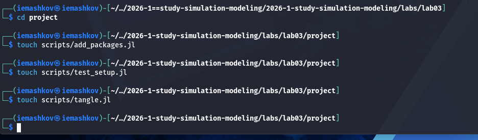
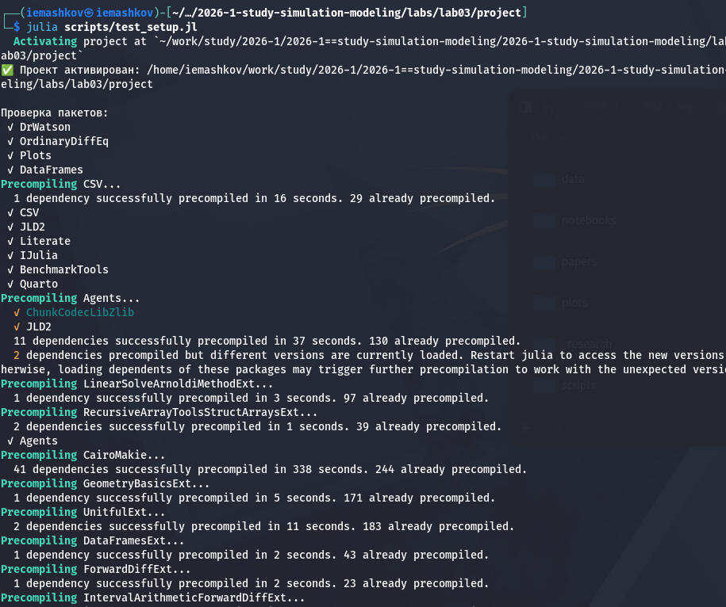
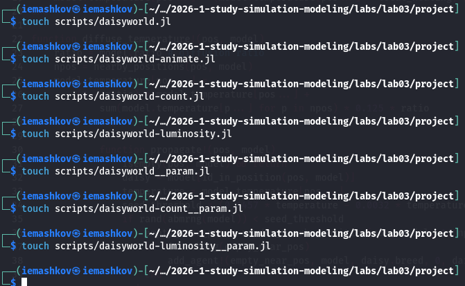
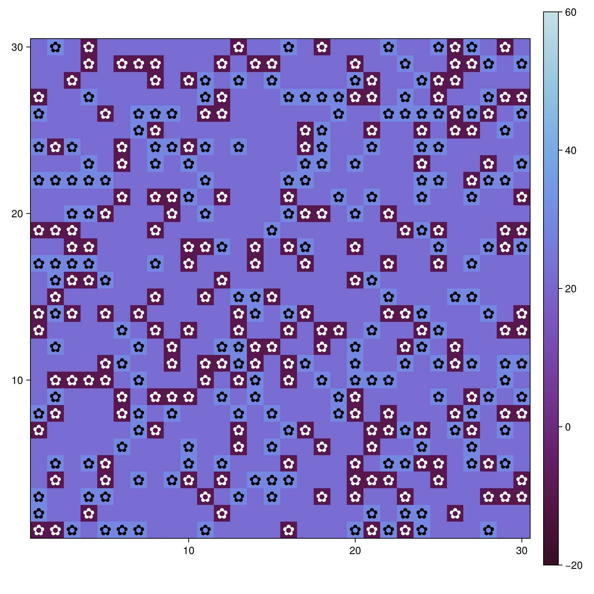
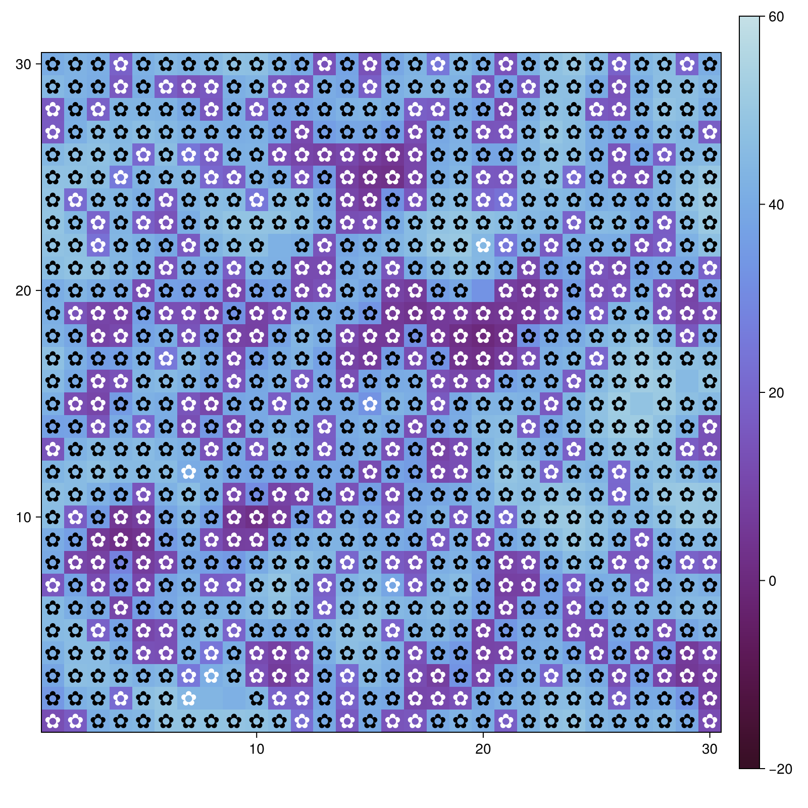
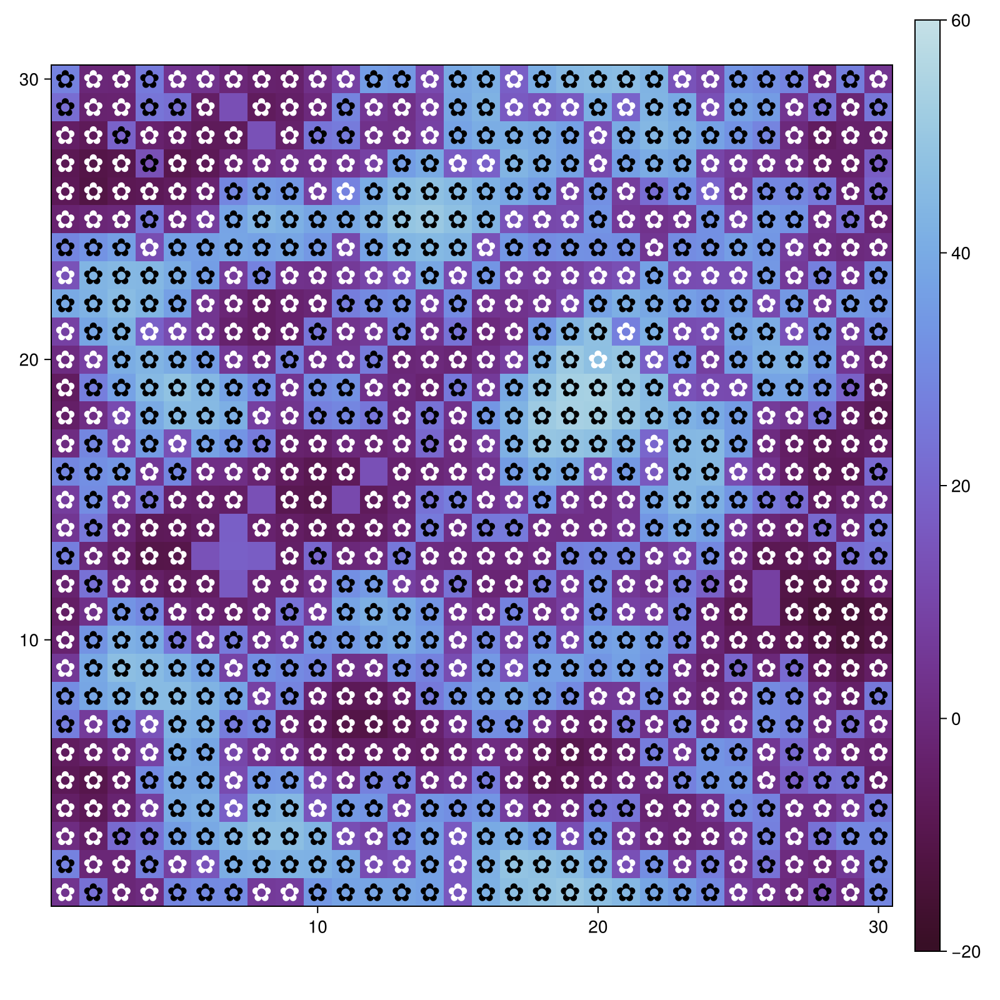
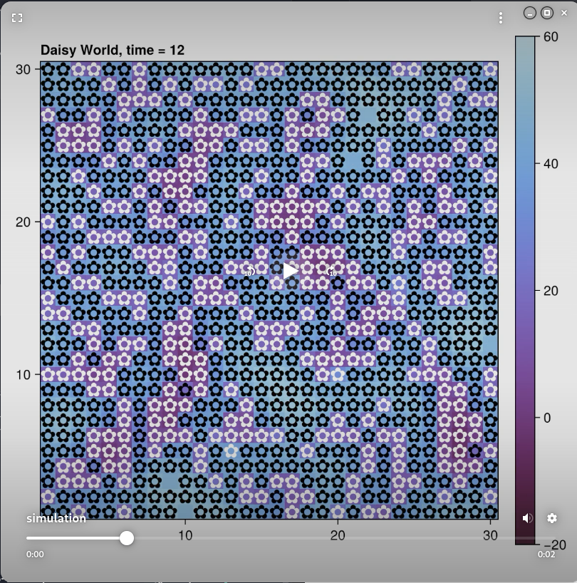
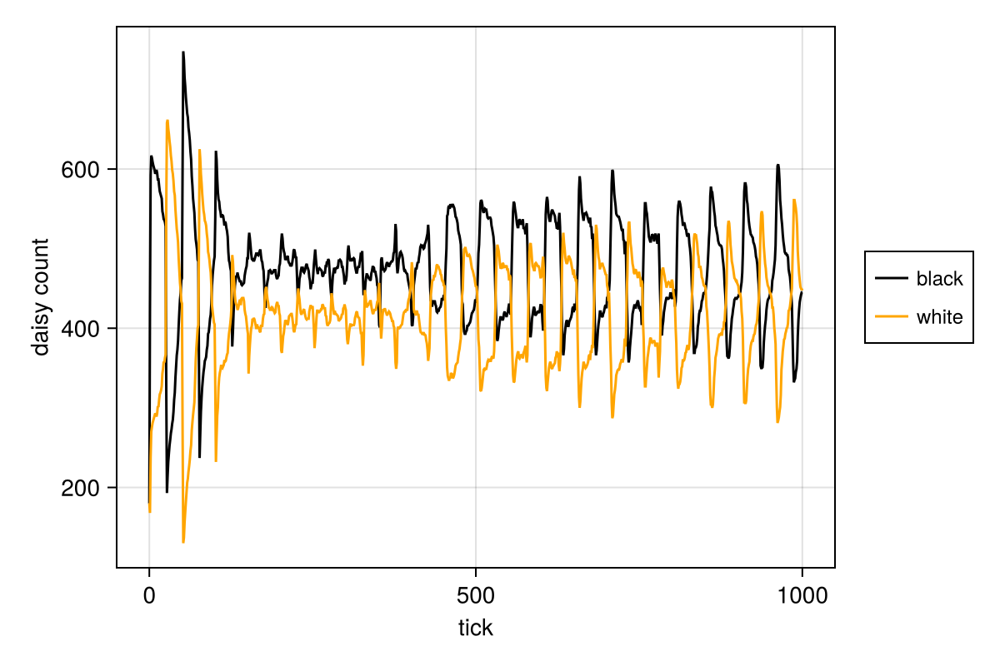
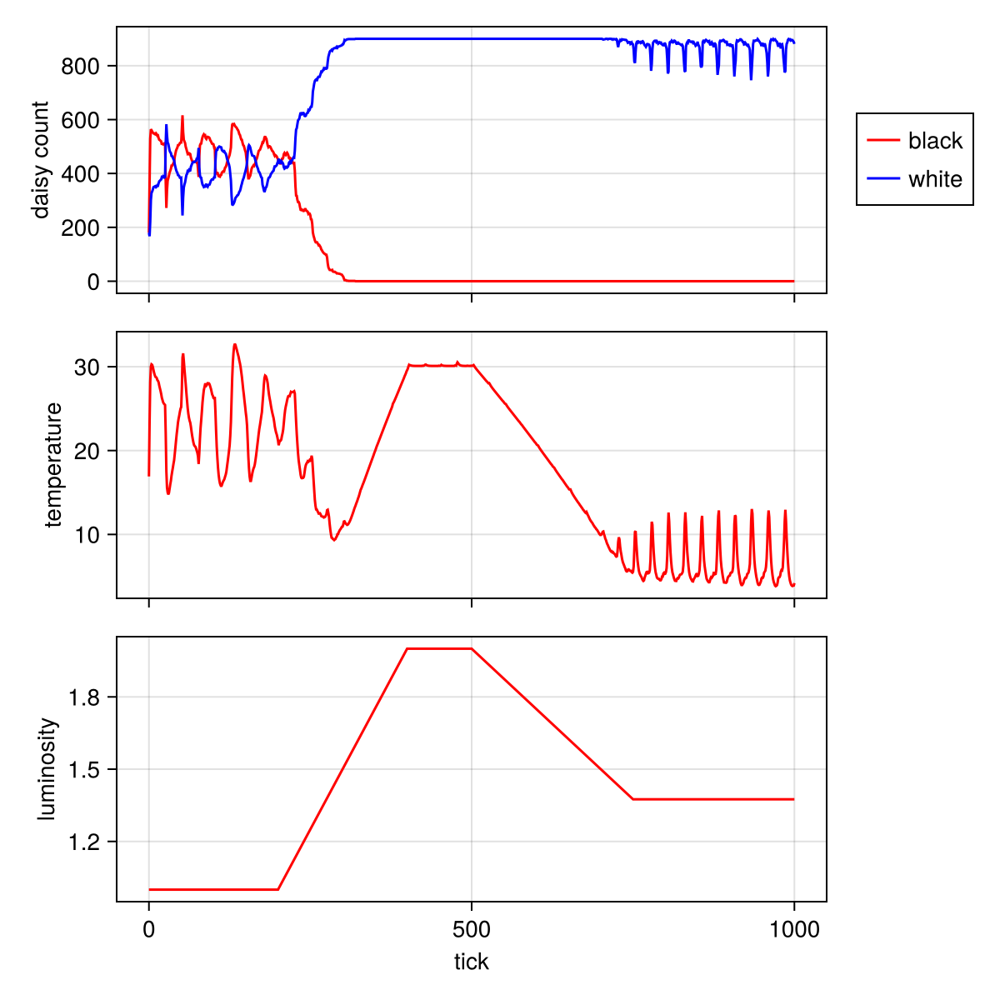

---
## Author
author:
  name: Машков И.Е.
  email: 1132231984@rudn.ru
  affiliation:
    - name: Российский университет дружбы народов
      country: Российская Федерация
      postal-code: 117198
      city: Москва
      address: ул. Миклухо-Маклая, д. 6

## Title
title: "Отчёт по лабораторной работе №3"
subtitle: "Имитационное моделирование"
license: "CC BY"
---

# Цель работы

Изучение агентного моделирования на основе модели Dasyworld

# Теория

Модель Daisyworld, предложенная Джеймсом Лавлоком и Эндрю Уотсоном, иллюстрирует гипотезу Геи. Гипотеза Геи рассматривает планету как единую, саморегулирующуюся систему, включающую как живые, так и неживые части.

В мире маргариток произрастают чёрные и белые маргаритки. Их альбедо различается: чёрные маргаритки поглощают свет и тепло, нагревая окружающую среду; белые маргаритки делают наоборот. Маргаритки могут размножаться только в определённом температурном диапазоне, а это значит, что слишком много (или слишком мало) тепла от солнца и/или окружающей среды в конечном итоге остановит их размножение.

Поверхность Земли нагревается солнцем, но растущие на ней маргаритки поглощают или отражают свет звёзд, изменяя локальную температуру.

Если температура становится слишком высокой или слишком низкой, маргаритки не захотят размножаться. Пока температура благоприятна, маргаритки конкурируют за землю и пытаются дать начало новому растению в местах, расположенных неподалёку от них.

Когда климат слишком холодный, черным маргариткам необходимо размножаться, чтобы повысить температуру, и наоборот — когда климат слишком теплый, необходимо производить больше белых маргариток, чтобы охладить климат.

# Задание 

— Создать рабочий каталог для кода.
— Установить необходимые пакеты.
— Выполнить предложенный код.
— Преобразовать код в литературный стиль.
— Сгенерировать из литературного кода:
— чистый код;
— jupyter notebook;
— документацию в формате Quarto.
— Выполнить код из jupyter notebook.
— Интегрировать документацию в формате Quarto в отчёт.
— Добавить в код в литературном стиле вычисление для набора параметров.
— Сгенерировать из литературного кода с параметрами:
— чистый код;
— jupyter notebook;
— документацию в формате Quarto.
— Выполнить код из jupyter notebook с параметрами.
— Интегрировать документацию с параметрами в формате Quarto в отчёт.

# Выполнение лабораторной работы

## Подготовка пространства для работы

Подготавливаю файлы для скриптов установки пакетов и проверки структуры проектов ([рис. @fig-001]).

{#fig-001 width=70%}

После установки пакетов запускаю проверку структуры проекта ([рис. @fig-002]).

{#fig-002 width=70%}

## Модель Daisyworld

В модели Daisyworld агентами являются чёрные и белые маргаритки. Они живут на клеточной сетке (среда).

Свойства агентов: вид и возраст.

Правила:
— Маргаритки изменяют локальную температуру за счёт разного альбедо.
— Температура влияет на вероятность размножения (чем ближе к оптимуму, тем выше шанс заселить соседнюю пустую клетку).
— Агенты стареют и умирают после определённого возраста.
— Среда (температура) диффундирует между клеткамию

Агенты: маргаритки двух типов — чёрные (black) и белые (white). Каждая маргаритка занимает одну клетку сетки и имеет возраст (количество шагов с момента появления).

Пространство: двумерная квадратная сетка (например, 30×30) с периодическими границами.

Параметры:
— luminosity – солнечная постоянная (может изменяться со временем).
— albedo_black, albedo_white – альбедо чёрных и белых маргариток.
— surface_albedo — альбедо пустой почвы.
— max_age — максимальный возраст маргаритки.

### Реализация модели

В директории src создаю файл модели Daisyworld ([рис. @fig-003]), в котором мы определяем тип агента и функции шага модели ([рис. @fig-004]).

{#fig-003 width=70%} 

{#fig-004 width=70%}

### Работа с моделью

Начинаем с создания файлов для наших скриптов ([рис. @fig-005]).

{#fig-005 width=70%}

#### Базовая визуализация

Создаю скрипт daisyworld, который создаёт тепловые карты модели с разными шагами: 0,01 ([рис. @fig-006]), 0,05 ([рис. @fig-007]), 0,4 ([рис. @fig-008]).

{#fig-006 width=70%}

{#fig-007 width=70%}

{#fig-008 width=70%}



#### Анимация модели

Создаю скрипт, который показывает нам визуализацию эволюции модели ([рис. @fig-009]). Здесь я сделал скриншот одного из шагов. Далее я выложу это и на гитхаб, и на видеохостинги.

{#fig-009 width=70%}



#### Динамика числа маргариток

Создаю скрипт для создания графика изменения числа маргариток, в зависимости от модельного времени ([рис. @fig-010]).

{#fig-010 width=70%}



#### Динамика модели

Создаю скрипт для отображения комплексного графика изменения числа маргариток, температуры альбедо в зависимости от модельного времени ([рис. @fig-011]).

{#fig-011 width=70%}



#### Базовая визуализация (параметры)

Создаю скрипт, который расширяет нашу визуализацию за счёт разных параметров:



#### Динамика числа маргариток (параметры)

Создаю скрипт для отрисовки графиков изменения числа маргариток с разными параметрами модели:



#### Динамика модели (параметры)

Создаю скрипт для отрисовки комплексных графиков изменения числа маргариток, альбедо с разными параметрами модели:



# Выводы

В процессе выполнения лабораторной работы я освоил агентное моделирование на основе изучения модели Daisyworld.

