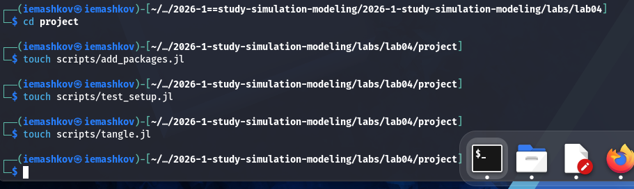
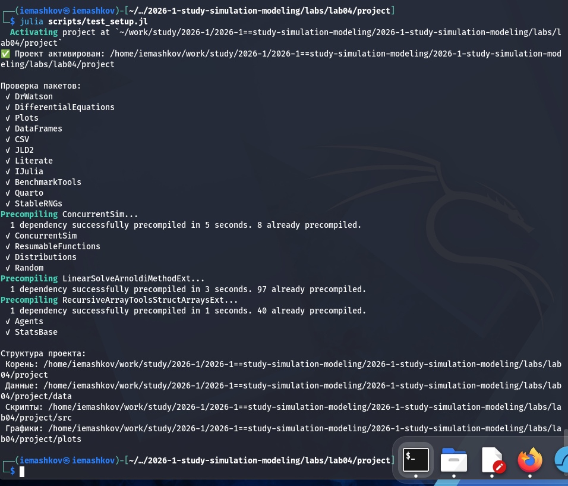
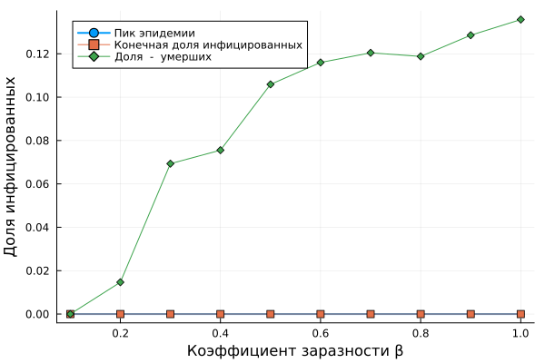
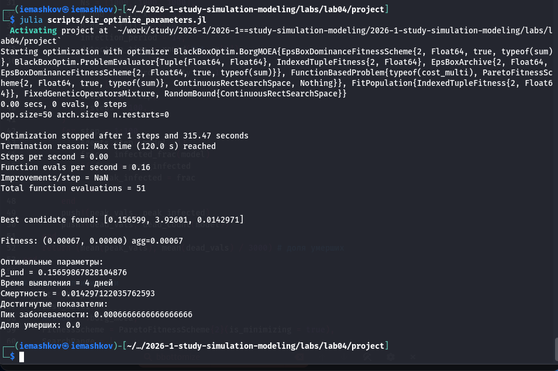
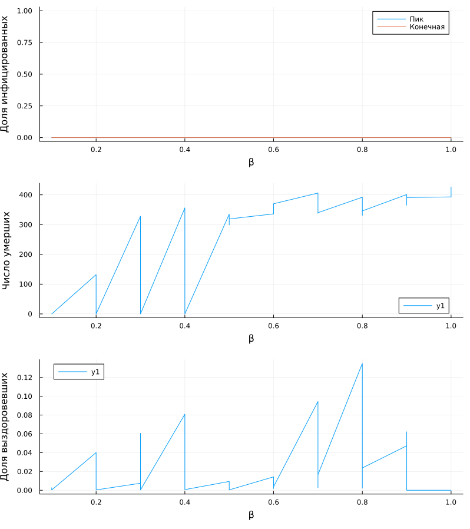
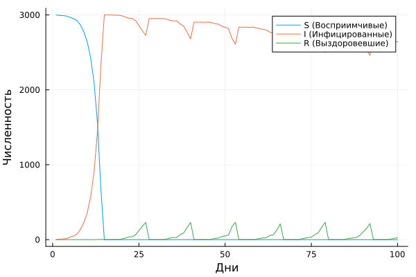
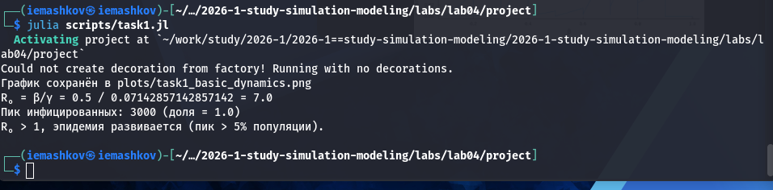
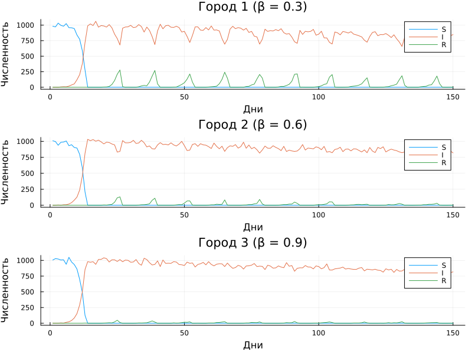
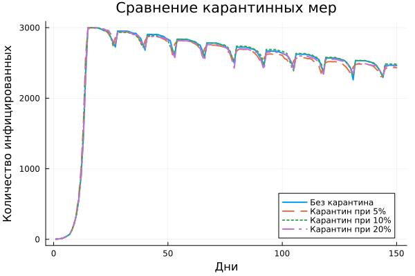

---
## Author
author:
  name: Машков И.Е.
  email: 1132231984@rudn.ru
  affiliation:
    - name: Российский университет дружбы народов
      country: Российская Федерация
      postal-code: 117198
      city: Москва
      address: ул. Миклухо-Маклая, д. 6

## Title
title: "Отчёт по лабораторной работе №4"
subtitle: "Имитационное моделирование"
license: "CC BY"
---

# Цель работы

Реализация модели SIR в агентном подходе

# Теория

Модель SIR, предложенная Кермаком и Маккендриком в 1927 году, описывает
динамику эпидемии в популяции, разделённой на три группы:
— S (Susceptible) — восприимчивые к заболеванию индивиды;
— I (Infectious) — инфицированные, способные заражать восприимчивых;
— R (Recovered) — выздоровевшие (или умершие), получившие иммунитет и более не участвующие в распространении.

Классическая модель описывается системой обыкновенных дифференциальных
уравнений:
𝑑𝑆/𝑑𝑡 = −𝛽𝑆𝐼/𝑁,
𝑑𝐼/𝑑𝑡 = 𝛽𝑆𝐼/𝑁 − 𝛾𝐼,
𝑑𝑅/𝑑𝑡 = 𝛾𝐼.
где 𝛽 — коэффициент передачи инфекции, 𝛾 — скорость выздоровления.

Агентное моделирование позволяет преодолеть эти ограничения:
— Каждый индивид моделируется отдельно с уникальными характеристиками.
— Взаимодействия происходят локально в пространстве или социальной сети.
— Процессы носят стохастический характер.
— Можно учитывать гетерогенность контактов, мобильность, меры контроля.

Каждый агент — человек, обладающий следующими свойствами:
— status::Symbol — состояние (:S, :I, :R);
— days_infected::Int — количество дней с момента заражения (для инфицированных).

Агенты размещаются на графе, где узлы представляют локации (города, районы), а рёбра — возможные перемещения между ними. Такой подход позволяет моделировать метапопуляционную динамику и миграцию.

Параметры:
— Ns — вектор численности населения по локациям;
— β_und — вероятность передачи для невыявленных случаев;
— β_det — вероятность передачи для выявленных случаев;
— infection_period — длительность заболевания (дней);
— detection_time — время до выявления заболевания;
— death_rate — вероятность летального исхода;
— reinfection_probability — вероятность повторного заражения;
— migration_rates — матрица вероятностей миграции между локациями.

На каждом шаге (соответствует одному дню) для каждого агента выполняются
следующие процессы :
— Миграция — агент может переместиться в другую локацию с вероятностью, заданной матрицей migration_rates.
— Передача инфекции — если агент инфицирован, он может заразить восприимчивых агентов в той же локации. Количество заражённых за день определяется пуассоновским процессом с интенсивностью, зависящей от статуса выявления (β_und или β_det).
— Обновление счётчика — для инфицированных увеличивается days_infected.
— Выздоровление или смерть — если days_infected достиг infection_period, агент либо выздоравливает (переходит в R), либо умирает (удаляется из модели) с вероятностью death_rate. Выздоровевшие могут быть повторно инфицированы с вероятностью reinfection_probability.

# Задание 

— Создать рабочий каталог для кода.
— Установить необходимые пакеты.
— Выполнить предложенный код.
— Преобразовать код в литературный стиль.
— Сгенерировать из литературного кода:
— чистый код;
— jupyter notebook;
— документацию в формате Quarto.
— Выполнить код из jupyter notebook.
— Интегрировать документацию в формате Quarto в отчёт.
— Добавить в код в литературном стиле вычисление для набора параметров.
— Сгенерировать из литературного кода с параметрами:
— чистый код;
— jupyter notebook;
— документацию в формате Quarto.
— Выполнить код из jupyter notebook с параметрами.
— Интегрировать документацию с параметрами в формате Quarto в отчёт.

# Выполнение лабораторной работы

## Подготовка пространства для работы

Создаю и заполняю кодом базовые скрипты для установки пакетов, проверки структуры и создания производных форматов ([рис. @fig-001]).

{#fig-001 width=70%}

После запуска скриптов убеждаюсь в том, что все пакеты установлены, а структура полностью соответствует всем нормам ([рис. @fig-002]).

{#fig-002 width=70%}

## Подготовка скриптов для модели

В директории src создаю файл модели SIR для использования агентного подхода, а затем создаю скрипты для работы с ней ([рис. @fig-003]).

{#fig-003 width=70%} 

### Базовый эксперимент

Запускаю базовый эксперимент и получаю график, по которому можно оценить пик эпидемии, скорость распространения и вляния смертности ([рис. @fig-004]).

{#fig-004 width=70%}



### Сканирование коэффициента заразности

Создаю скрипт для изучения того, как изменение базовой заразности влияет на эпидемические показатели ([рис. @fig-005]).

{#fig-005 width=70%}



### Исследование эффекта миграции

Создаю скрипт для исследования того, как интенсивность перемещения людей между городами влияет на скорость распространения эпидемии и масштаб пика ([рис. @fig-006]). Инфекция начинается только в одном городе, остальные изначально здоровы.

{#fig-006 width=70%}



### Многокритериальная оптимизация параметров

Создаю скрипт для поиска оптимальных комбинаций параметров, минимизирующих одновременно два критерия: пиковую заболеваемость и долю умерших ([рис. @fig-007]). 

{#fig-007 width=70%}



### Сводная визуализация результатов

Создаю скрипт для построения трёх графиков: пик эпидемии и конечная доля инфицированных, число умерших, доля выздоровевших ([рис. @fig-008]).

{#fig-008 width=70%}



### Дополнительные задания

#### Базовый уровень

Создаю скрипт базового эксперимента и вычисляю базовое репродуктивное число ([рис. @fig-010]) и график ([рис. @fig-009]).

{#fig-009 width=70%}

{#fig-010 width=70%} 



#### Исследование порога

Далее создаю скрипт для исследования коэффициента заразности, а именно для поиска минимального значения, при котором возникает эпидемия и сравнение с теоретическим порогом ([рис. @fig-011]).

{#fig-011 width=70%}



#### Эффект гетерогенности

Создаю скрипт для изучения влияния коэффициента заразности на общую динамику на примере трёх разных городов ([рис. @fig-012]).

{#fig-012 width=70%}



#### Миграция

Создаю скрипт для исследования влияния интенсивности миграции на скорость распространения инфекции из одного города в другие ([рис. @fig-013]).

{#fig-013 width=70%}



#### Карантинные меры 

Создаю новую модель, в которой есть возможность закрытия города на карантин ([рис. @fig-014]).

{#fig-014 width=70%}



#### Оптимизация 

Создаю скрипт для оптимизации параметров для минимизации смертности при сохранении пика заболеваемости ниже 30% ([рис. @fig-015]).

{#fig-015 width=70%}



# Выводы

Во время выполнения данной лабораторной работы я реализовал исследование модели SIR с помощью агентного подхода.

