---
## Author
author:
  name: Машков И.Е.
  email: 1132231984@rudn.ru
  affiliation:
    - name: Российский университет дружбы народов
      country: Российская Федерация
      postal-code: 117198
      city: Москва
      address: ул. Миклухо-Маклая, д. 6

## Title
title: "Отчёт по лабораторной работе №5"
subtitle: "Имитационное моделирование"
license: "CC BY"
---

# Цель работы

Изучение модели сетей Петри

# Теория

Сеть Петри есть математический аппарат для моделирования дискретных систем. Графически она представляется как двудольный ориентированный граф двух типов вершин: позиции (круги) и переходы (прямоугольники).
— Позиции (Places) суть пассивные элементы, описывающие состояние системы (например, наличие ресурса или выполнение условия).
— Внутри позиции могут находиться фишки (tokens) — неотрицательное целое число, указывающее на количество ресурсов.
— Переходы (Transitions) суть активные элементы, описывающие события или действия системы.
— Они могут срабатывать, изменяя состояние модели.
— Дуги (Arcs) суть направленные соединения между позициями и переходами (но не между двумя позициями или двумя переходами), которые показывают, как состояние влияет на события и наоборот.
— Маркировка (Marking) есть распределение фишек по позициям в определённый момент времени, то есть текущее состояние модели.
— Смена маркировок происходит при срабатывании переходов в соответствии с определёнными правилами.
Теория сетей Петри, появившаяся как инструмент для анализа химических процессов, сегодня является мощным и наглядным математическим аппаратом. Она незаменима везде, где нужно описать параллельные, асинхронные и распределённые системы. В её основе лежат всего четыре элемента, а богатство поведения возникает из их комбинации.

# Задание 

— Создать рабочий каталог для кода.
— Установить необходимые пакеты.
— Выполнить предложенный код.
— Преобразовать код в литературный стиль.
— Сгенерировать из литературного кода:
— чистый код;
— jupyter notebook;
— документацию в формате Quarto.
— Выполнить код из jupyter notebook.
— Интегрировать документацию в формате Quarto в отчёт.
— Добавить в код в литературном стиле вычисление для набора параметров.
— Сгенерировать из литературного кода с параметрами:
— чистый код;
— jupyter notebook;
— документацию в формате Quarto.
— Выполнить код из jupyter notebook с параметрами.
— Интегрировать документацию с параметрами в формате Quarto в отчёт.

# Выполнение лабораторной работы

## Подготовка окружения

Создаю базовые скрипты, а затем, после установки всех необходимых пакетов, запускаю проверку структуры ([рис. @fig-001]).

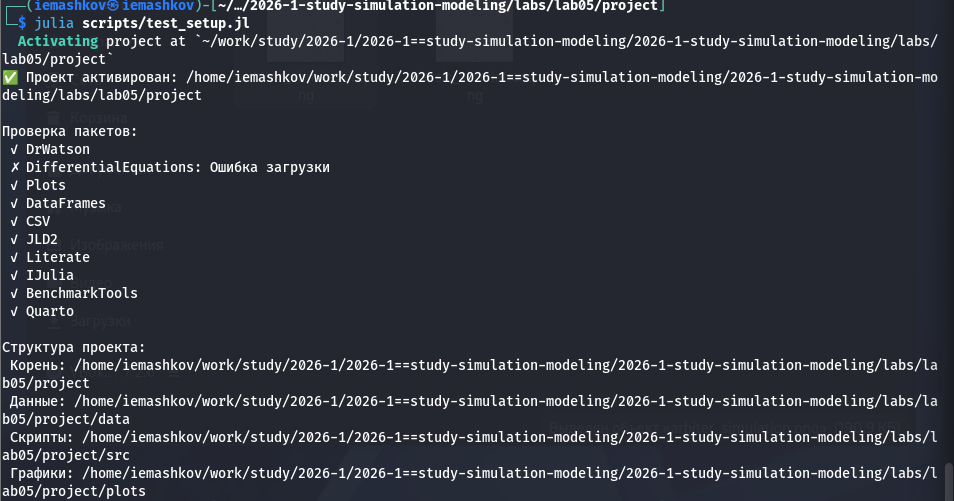{#fig-001 width=70%}

## Работа с моделью

Сощдаю файл модели "Обедающие философы"([рис. @fig-002]). 

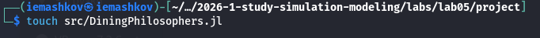{#fig-002 width=70%}

Суть модели состоит в следующем:

За круглым столом сидят N философов (обычно 5). Перед каждым философом стоит тарелка с едой. Между каждыми двумя соседними философами лежит одна вилка (или палочка для еды). Таким образом, количество вилок равно количеству философов.
Правила поведения философов:
— Философ может находиться в одном из трёх состояний: думает, голоден (хочет есть), ест.
— Чтобы поесть, философу необходимы две вилки — та, что слева от него, и та, что справа.
— Если философ не может получить обе вилки одновременно, он ждёт, пока они освободятся.
— Поев, философ кладёт обе вилки обратно на стол и возвращается к размышлениям.

Ограничения:
— Вилками нельзя пользоваться одновременно двум философам.
— Философ не может отнять вилку у соседа — только дождаться, пока тот её положит.

При наивной реализации (каждый философ сначала берёт левую вилку, затем правую) возникает тупиковая ситуация: если все философы одновременно возьмут левую вилку, то каждый будет ждать правую, которая уже занята соседом.
В результате никто не может поесть — система замирает. Это и есть взаимная блокировка.

Для предотвращения deadlock предложены различные подходы:
— Арбитр (официант) — вводится дополнительный процесс, который разрешает есть не более чем N-1 философам одновременно.
— Асимметричное правило — философы с нечётным номером сначала берут левую вилку, затем правую, а чётные — наоборот.
— Атомарный захват — философ берёт обе вилки одновременно (если они свободны) иначе не берёт ни одной.
— Использование мьютексов и условных переменных в программных реализациях.

#### Работа с моделью: Базовый скрипт

Создаю скрипт для базового эксперимента ([рис. @fig-003]). 

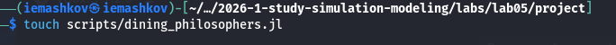{#fig-003 width=70%} 

Суть эксперимента состоит выполнении основного моделирования и сравнения двух вариантов сети Петри:
— классическая модель (без арбитра), в которой возможна взаимная блокировка (deadlock);
— модифицированная модель с арбитром, которая должна предотвращать deadlock.

После запуска получаем следующий итог: в сети без арбитра возникла взаимная блокировка, а там, где он есть Блокировки не проищошло ([рис. @fig-004]).

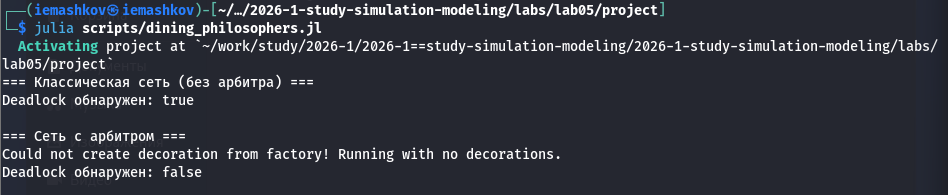{#fig-004 width=70%}

Затем создаю производные форматы с помощью скрипта tangle.jl ([рис. @fig-005]).

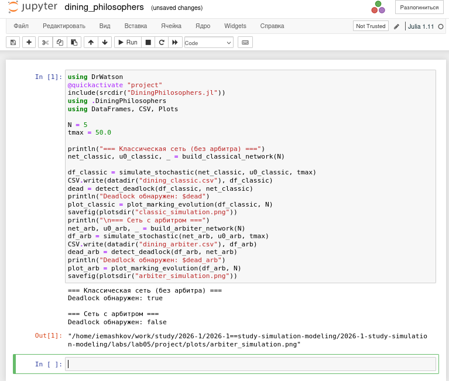{#fig-005 width=70%}

Получаю соответствующие графики: случай с арбитром ([рис. @fig-006]) и без ([рис. @fig-007]).

{#fig-006 width=70%}

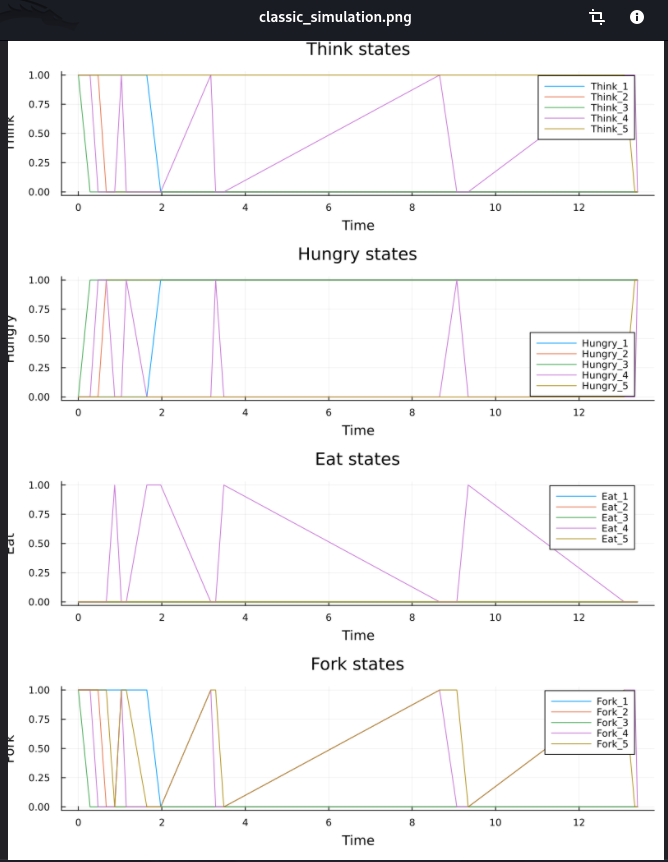{#fig-007 width=70%}



### Работа с моделью: Анимация

Создаю скрипт анимации для демонстрации динамики работы сети Петри во времени ([рис. @fig-008]). 

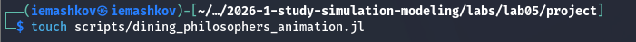{#fig-008 width=70%}

Запускаю и получаю .gif столбчатую диаграмму ([рис. @fig-009]). 

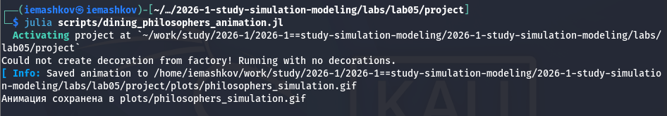{#fig-009 width=70%} 

С помощью tangle получаю производные форматы ([рис. @fig-010]). 

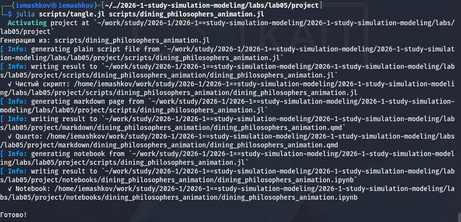{#fig-010 width=70%} 

Здесь запечатлел момент из гифки ([рис. @fig-011]). 

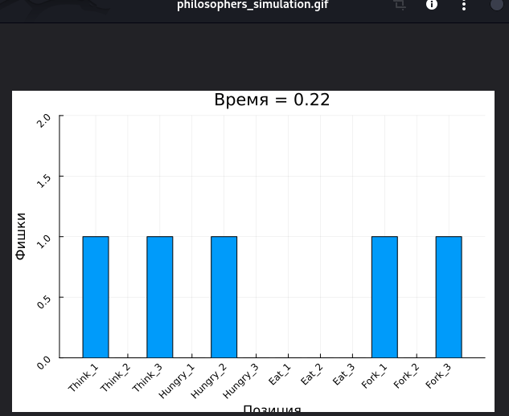{#fig-011 width=70%} 



### Работа с моделью: отчёт

Создаю скрипт для подведения итогов ([рис. @fig-012]). 

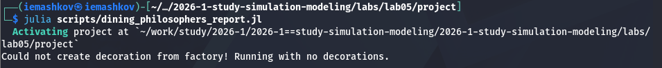{#fig-012 width=70%}

Перевожу в производные форматы ([рис. @fig-013]). 

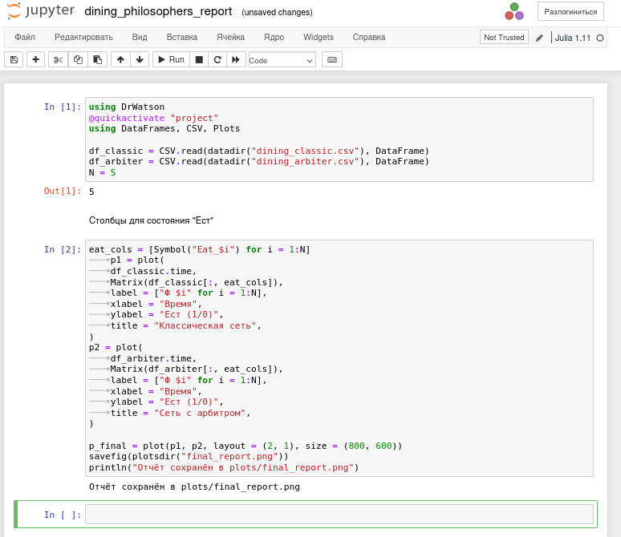{#fig-013 width=70%}

Получаю сводный график сравнния сети с арбитром и без, где учитывается только число философоф, находящихся в состоянии "ЕСТ" ([рис. @fig-014]). 

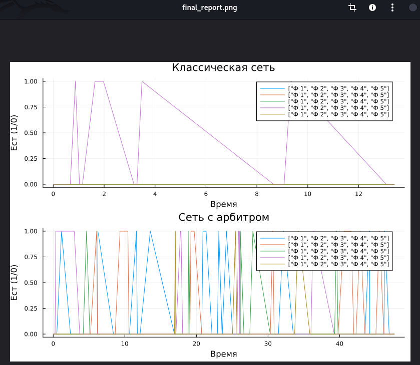{#fig-014 width=70%}



# Выводы

На примере модели DiningPhilosophers мы научились работать с сетями Петри и устранять взаимную блокировку.

