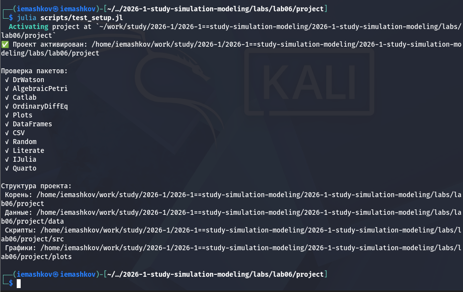
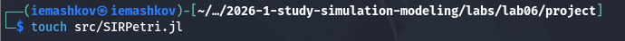
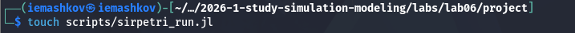
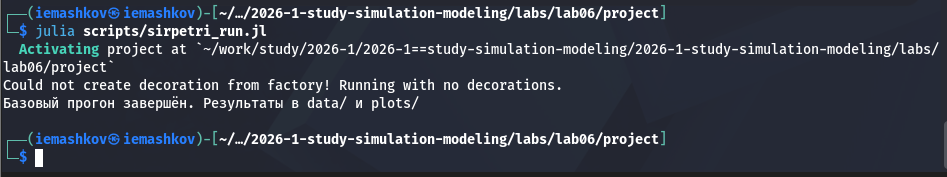
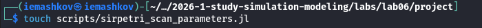
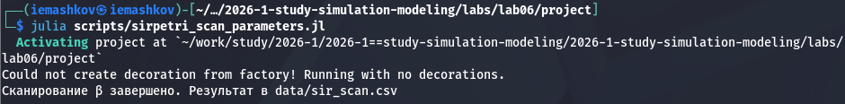
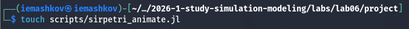
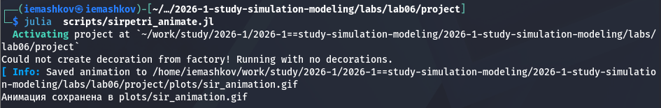

---
## Author
author:
  name: Машков И.Е.
  email: 1132231984@rudn.ru
  affiliation:
    - name: Российский университет дружбы народов
      country: Российская Федерация
      postal-code: 117198
      city: Москва
      address: ул. Миклухо-Маклая, д. 6

## Title
title: "Отчёт по лабораторной работе №6"
subtitle: "Имитационное моделирование"
license: "CC BY"
---

# Цель работы

Изучить модель SIR.

# Задание 

— Создать рабочий каталог для кода.
— Установить необходимые пакеты.
— Выполнить предложенный код.
— Преобразовать код в литературный стиль.
— Сгенерировать из литературного кода:
— чистый код;
— jupyter notebook;
— документацию в формате Quarto.
— Выполнить код из jupyter notebook.
— Интегрировать документацию в формате Quarto в отчёт.
— Добавить в код в литературном стиле вычисление для набора параметров.
— Сгенерировать из литературного кода с параметрами:
— чистый код;
— jupyter notebook;
— документацию в формате Quarto.
— Выполнить код из jupyter notebook с параметрами.
— Интегрировать документацию с параметрами в формате Quarto в отчёт.

# Выполнение лабораторной работы

Начинаем с проверки правильности структуры нашего проекта ([рис. @fig-001]).

{#fig-001 width=70%}

## Реализация модели

Создаём скриптЮ в который мы вписываем код нашей модели ([рис. @fig-002]).

{#fig-002 width=70%}

### Работа с первым скриптом

Создаём первый скрипт ([рис. @fig-003]), задача которого: 
— Выполняет один базовый эксперимент с фиксированными параметрами $β = 0.3, γ = 0.1$.
— Запускает два типа симуляции:
— детерминированную (решение ОДУ) — даёт плавную усреднённую динамику;
— стохастическую (алгоритм Гиллеспи) — учитывает случайные флуктуации.
— Сохраняет результаты в CSV‑файлы и строит графики S(t), I(t), R(t) для обоих типов.

{#fig-003 width=70%}

Затем запускаю его ([рис. @fig-004]).

{#fig-004 width=70%}

Затем преобразую его в формат .ipunb и .qmd.



— Детерминированный график показывает классический пик эпидемии: рост $I$, максимум, затем спад до нуля; $R$ растёт и выходит на плато, $S$ падает.
— Стохастический график может иметь шумы и, возможно, немного отличаться по времени пика и амплитуде – это демонстрирует влияние случайности.
— Сравнение двух типов симуляции показывает, что при большом начальном числе восприимчивых (990) стохастическая траектория близка к детерминированной, но при малых числах различия были бы значительны.

### Работа со вторым скриптом

Создаём второй скрипт ([рис. @fig-005]), задача которого: 
— Исследуется чувствительность модели к изменению параметра $β$ (скорости заражения).
— Для каждого значения $β$ из диапазона $0.1:0.05:0.8$ запускается детерминированная симуляция ($γ = 0.1$ фиксирован).
— Для каждого прогона вычисляются:
— максимальное число инфицированных (пик эпидемии) – peak_I;
— конечное число выздоровевших – final_R.
— Результаты сводятся в таблицу и строится график зависимости peak_I(β) и final_R(β)

{#fig-005 width=70%}

Затем запускаю его ([рис. @fig-006]).

{#fig-006 width=70%}

Затем преобразую его в формат .ipunb и .qmd.



— При малых $β$ (например, 0.1) эпидемия не возникает ($peak_I ≈ 0$, $final_R ≈ 0$).
— С ростом $β$ пик заболеваемости сначала резко растёт, затем достигает насыщения (почти всё население переболевает). 
— Конечное $R(β)$ также растёт с $β$, но медленнее; при больших $β$ практически всё население переходит в $R$.
— Такой график демонстрирует пороговое явление, характерное для модели SIR: существует критическое значение $β$, выше которого возникает вспышка.

### Работа с третьим скриптом

Создаём второй скрипт ([рис. @fig-007]), задача которого: 
— Создаёт GIF-анимацию, показывающую, как со временем меняется количество людей в каждой из трёх групп (S, I, R).
— Анимация позволяет наглядно увидеть распространение эпидемии, пик и спад.

{#fig-007 width=70%}

Затем запускаю его ([рис. @fig-008]).

{#fig-008 width=70%}

Затем преобразую его в формат .ipunb и .qmd.



— На первых кадрах I растёт, S падает.
— В момент пика I достигает максимума, затем снижается, а R растёт.
— Анимация даёт динамическое представление о том, как волна инфекции проходит через популяцию.

### Работа с четвёртым скриптом

Создаём второй скрипт, задача которого: 
— Загружает ранее сохранённые результаты (sir_det.csv, sir_stoch.csv, sir_scan.csv) и строит сравнительные графики для итогового отчёта:
— Сравнение детерминированной и стохастической динамики инфицированных I(t).
— Зависимость пика I от β (результат сканирования).

Затем запускаю его.

Затем преобразую его в формат .ipunb и .qmd ([рис. @fig-009]).

![Преобразование всх четырёх скриптов(image/9.png){#fig-009 width=70%}



— Сравнение детерминированной и стохастической кривых I(t) показывает, насколько велик разброс, вызванный случайностью. При большом размере популяции они близки.
— График чувствительности позволяет количественно оценить, как изменение заразности β влияет на тяжесть эпидемии (пик I). Это важно для принятия решений (например, меры по снижению β).

# Выводы

Мы изучили модель SIRPetri.

