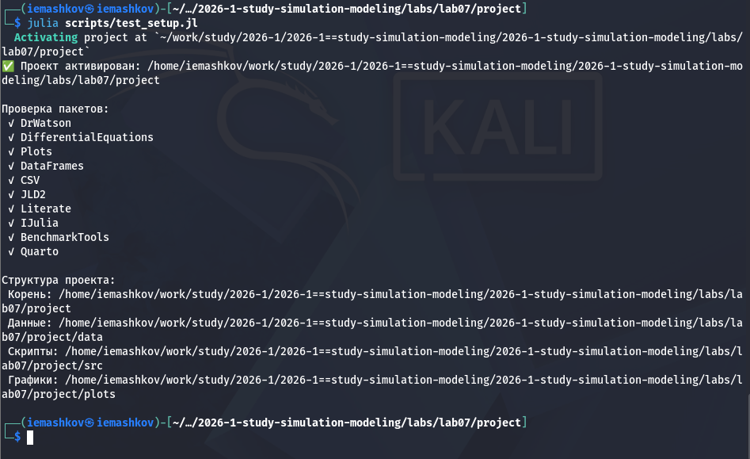
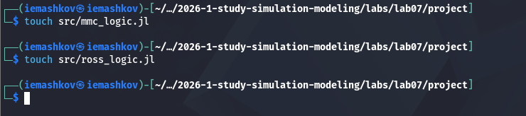
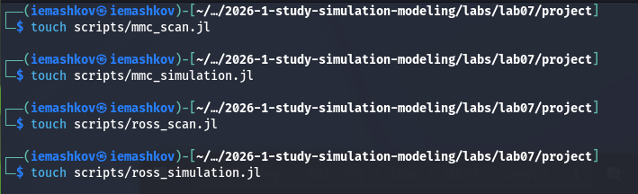
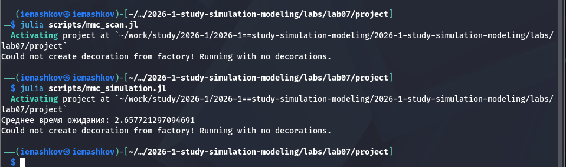
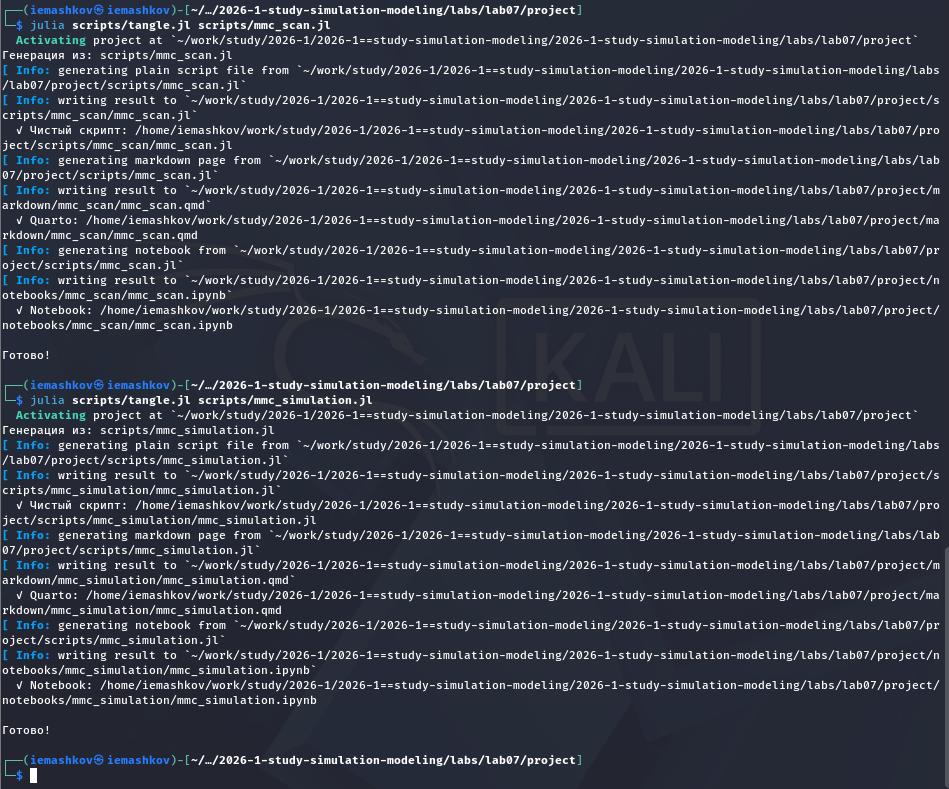
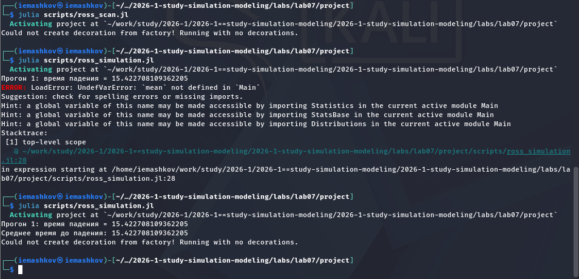
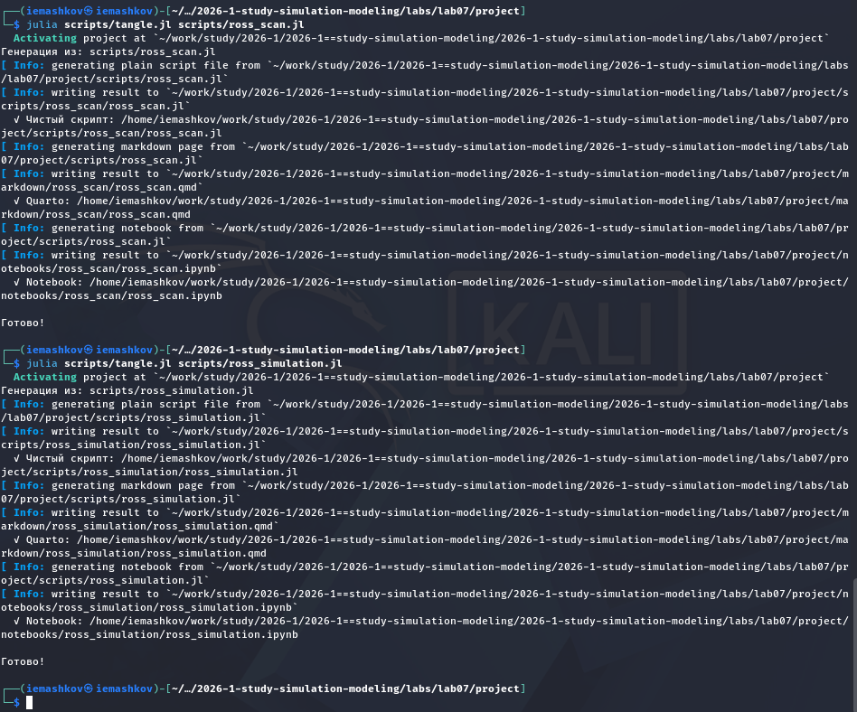

---
## Author
author:
  name: Машков И.Е.
  email: 1132231984@rudn.ru
  affiliation:
    - name: Российский университет дружбы народов
      country: Российская Федерация
      postal-code: 117198
      city: Москва
      address: ул. Миклухо-Маклая, д. 6

## Title
title: "Отчёт по лабораторной работе №7"
subtitle: "Имитационное моделирование"
license: "CC BY"
---

# Цель работы

Изучить модели MMc и модель Росса.

# Задание 

— Создать рабочий каталог для кода.
— Установить необходимые пакеты.
— Выполнить предложенный код.
— Преобразовать код в литературный стиль.
— Сгенерировать из литературного кода:
— чистый код;
— jupyter notebook;
— документацию в формате Quarto.
— Выполнить код из jupyter notebook.
— Интегрировать документацию в формате Quarto в отчёт.
— Добавить в код в литературном стиле вычисление для набора параметров.
— Сгенерировать из литературного кода с параметрами:
— чистый код;
— jupyter notebook;
— документацию в формате Quarto.
— Выполнить код из jupyter notebook с параметрами.
— Интегрировать документацию с параметрами в формате Quarto в отчёт.

# Выполнение лабораторной работы

Начинаем с проверки правильности структуры нашего проекта ([рис. @fig-001]).

{#fig-001 width=70%}

## Реализация моделей

Создаём файлы, в которые мы вписываем коды модели MMc и модели Росса ([рис. @fig-002]).

{#fig-002 width=70%}

Затем создаём скрипты для реализации графикоы и т.д. ([рис. @fig-003]).

{#fig-003 width=70%}

### Работа со скриптами для первой модели

После того, как мы заполнили скрипты кодом, запускаем их ([рис. @fig-004]).

{#fig-004 width=70%}

Затем преобразую их в формат .ipunb и .qmd ([рис. @fig-005]).

{#fig-005 width=70%}

Первый скрипт (mmc_scan):



Второй скрипт (mmc_simulation): 



### Работа со скриптами для второй модели

После заполнения скриптов кодом, запускаю их ([рис. @fig-006]).

{#fig-006 width=70%}

Затем преобразую их в формат .ipunb и .qmd ([рис. @fig-007]).

{#fig-007 width=70%}

Первый скрипт (ross_scan):



Второй скрипт (ross_simulation): 



# Выводы

Мы изучили модели MMc и Росса.

