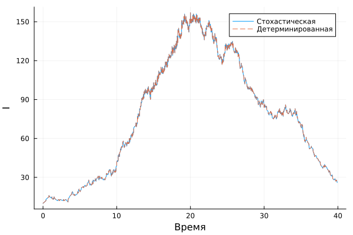
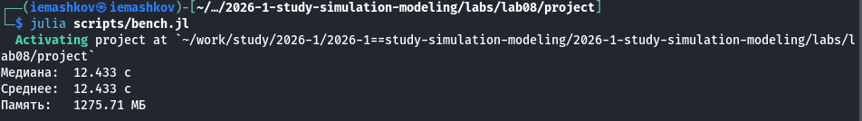
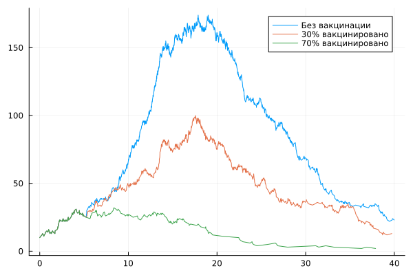
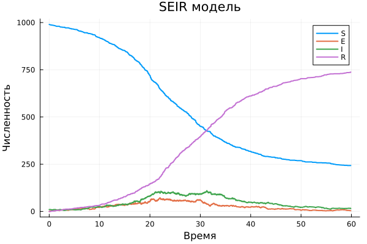

---
## Author
author:
  name: Машков Илья Евгеньевич
  email: 1132231984@rudn.ru
  affiliation:
    - name: Российский университет дружбы народов
      country: Российская Федерация
      postal-code: 117198
      city: Москва
      address: ул. Миклухо-Маклая, д. 6
## Title
title: Лабораторная работа №8
subtitle: Имитационное моделирование
license: CC BY
date: 2026-09-03
date-format: "YYYY-MM-DD"
---

## Цель работы

Изучить дискретно-событийный подход имитационного моделирования на примере модели SIR

## Выполнение лабораторной работы

{width=50%} 

## Выполнение лабораторной работы

{width=50%}

## Выполнение лабораторной работы

{width=50%}

## Выполнение лабораторной работы

{width=50%}

## Выполнение лабораторной работы

{width=50%}

## Выполнение лабораторной работы

{width=50%}

## Выполнение лабораторной работы

{width=50%} 

## Выводы

В процессе выполнения ЛР я изучил дискретно-событийный подход на примере модели SIR. Изучил его плюсы в прогнозировании различных событий из-за добавления случайности.

