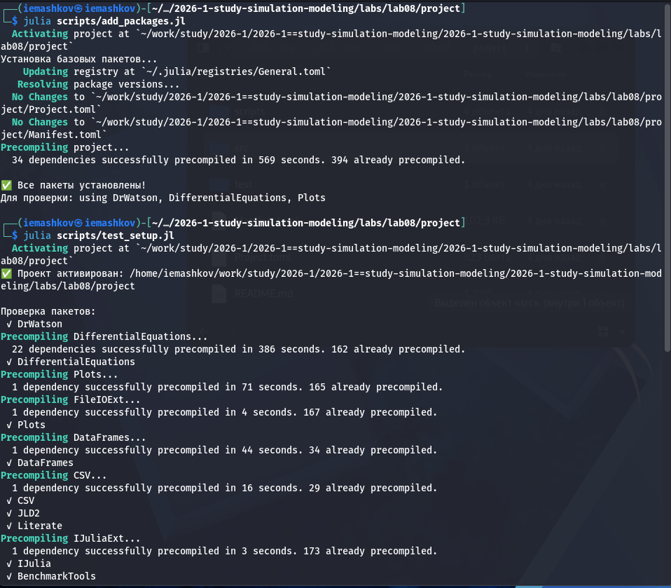
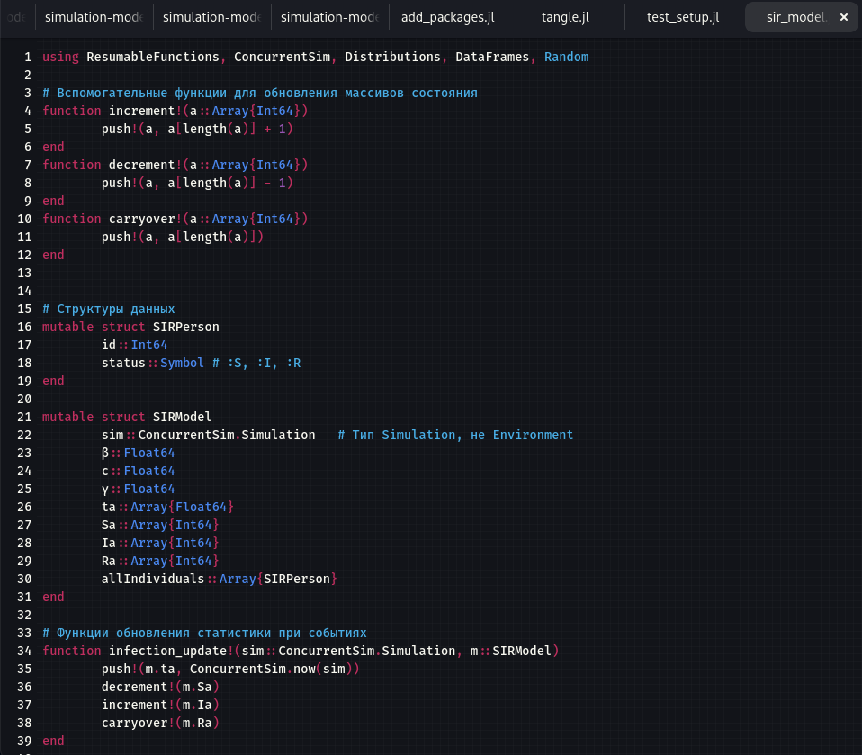
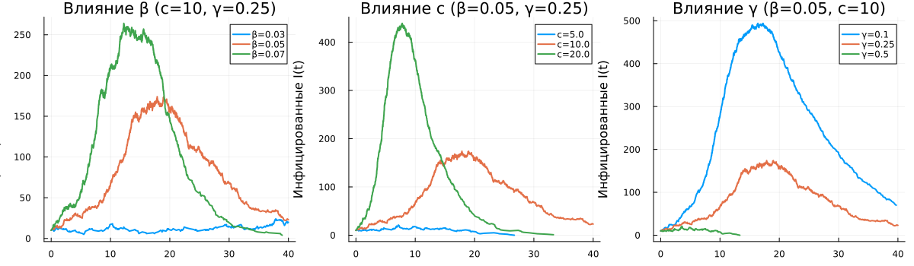
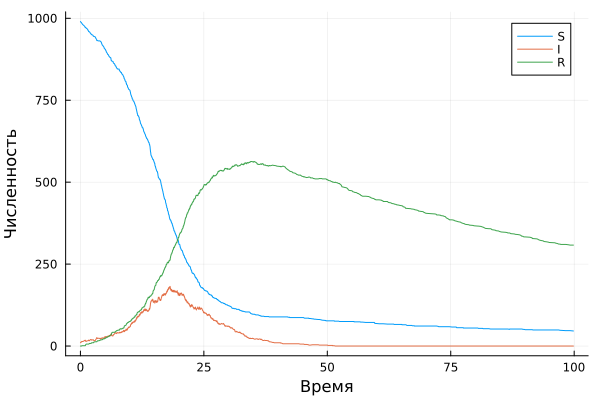

---
## Author
author:
  name: Машков И.Е.
  email: 1132231984@rudn.ru
  affiliation:
    - name: Российский университет дружбы народов
      country: Российская Федерация
      postal-code: 117198
      city: Москва
      address: ул. Миклухо-Маклая, д. 6

## Title
title: "Отчёт по лабораторной работе №8"
subtitle: "Имитационное моделирование"
license: "CC BY"
---

# Цель работы

Изучить дискретно-событийный подход имитационного моделирования на примере модели SIR

# Задание 

— Создать рабочий каталог для кода.
— Установить необходимые пакеты.
— Выполнить предложенный код.
— Преобразовать код в литературный стиль.
— Сгенерировать из литературного кода:
— чистый код;
— jupyter notebook;
— документацию в формате Quarto.
— Выполнить код из jupyter notebook.
— Интегрировать документацию в формате Quarto в отчёт.
— Добавить в код в литературном стиле вычисление для набора параметров.
— Сгенерировать из литературного кода с параметрами:
— чистый код;
— jupyter notebook;
— документацию в формате Quarto.
— Выполнить код из jupyter notebook с параметрами.
— Интегрировать документацию с параметрами в формате Quarto в отчёт.

# Выполнение лабораторной работы

## Подготовка пространства

Создаю базовые скрипты для установки пакетов, проверки структуры и создания производных форматов. Загружаю пакеты и проверяю структуру ([рис. @fig-001]).

{#fig-001 width=70%}

## Модель seir в дискретно событийном подходе

Создаю скрипты и файлы модели и перехожу к реализации модели SIR ([рис. @fig-002]). Логика работы сводится к реализации стохастической реализации нашей модели:

— Пока индивид находится в состоянии :S:
— Ожидает случайное время, распределённое экспоненциально с параметром 1/c. Это моделирует промежуток до следующего социального контакта.
— После ожидания выбирает случайного собеседника (alter) из всей популяции (исключая себя).
— Если собеседник в состоянии :I, то с вероятностью β происходит заражение: статус меняется на :I и вызывается infection_update!.
— Если индивид стал инфицированным (:I):
— Ожидает время до выздоровления, распределённое экспоненциально с параметром 1/γ.
— После этого статус меняется на :R, и вызывается recovery_update!. 

Благодаря конкурентному выполнению всех агентов (каждый запущен как отдельный процесс), симуляция естественно воспроизводит стохастическую динамику эпидемии.

{#fig-002 width=70%}

### Реализация простейшего скрипта

Далее работаю со скриптом sir_des, который строит график для просмотра данных нашей модели ([рис. @fig-003]). На графике видим небольшие скачки, т.е. график не состоит из прямой линии, а наоборот, она содержит небольшие скачки, что полностью отражает случайность в нашей модели.

{#fig-003 width=70%} 





### Дополнительные задания 

#### Исследование чувствительности

Создаём скрипт, который с помощью цикла будет варьировать параметры (бэта, гамма и си) для того, чтобы понять чувтвительность нашей модели ([рис. @fig-004]).

{#fig-004 width=70%}



#### Сравнение с детерминированной моделью 

Создаю вторую модель, в которой реализуется стандартная, детерминированная модель, для сравнения с нашей, стохастической. Также создаю скрипт, который и будет проводить сравнение и построение графика. Как мы видим, на графике у детерминированной модели отсечены хвосты и прямая более стабильна, нежели стохастическая ([рис. @fig-005]).

{#fig-005 width=70%}





#### Оценка производительности

Создаю скрипт для бенчмарка нашей модели при 10000 особях ([рис. @fig-006]). 

{#fig-006 width=70%}



#### Сохранение результатов в CSV 

Это я уже реализовал в базовом скрипте.



#### Добавление демографических событий 

Создаём новый файл модели, в который добавляем возможность смерти и рождение новых восприимчивых (хоть и присутствует возможность рождения невосприимчивого ребёнка у уже переболевших родителей).



Звтем создаю скрипт для проверки модели и вывода графика ([рис. @fig-007]). На графике видим резкое падение здоровых людей и постепенное уменьшение кол-ва выздоровевших.

{#fig-007 width=70%}



#### Вакцинация

Создаём модель, в которой будет реализована стратегия вакцинации. Суть в том, что определённая часть восприимчивых становятся переболевшими. Цель состоит в том, чтобы исследовать нужную долю вакцинированных для предотвращения болезни.



Создаю скрипт для проверки модели и визуализации полученных данных ([рис. @fig-008]). На графике видим, что при 70% вакцинированных эпидемия не доходит до своего пика и быстро затухает, потому что при вакцинации человек не является переносчиком болезни и, следовательно, она просто не может распространяться.

{#fig-008 width=70%}



#### SEIR

Создаём модель в которой добавляется латентный переход E, с которого человек может стать инфицированным через какое-то время 



Также создаю скрипт для проверки модели ([рис. @fig-009]). Как видно на графике, пик заболевших стал меньше и настал позже.

{#fig-009 width=70%} 



# Выводы

В процессе выполнения ЛР я изучил дискретно-событийный подход на примере модели SIR. Изучил его плюсы в прогнозировании различных событий из-за добавления случайности.

